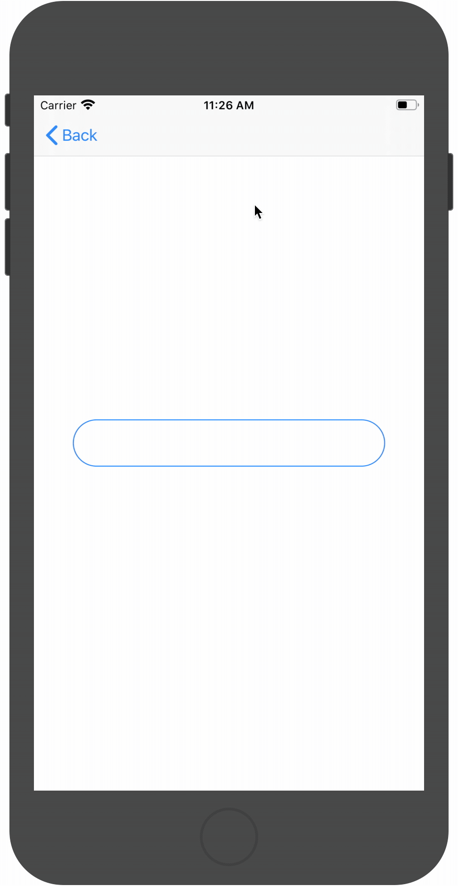
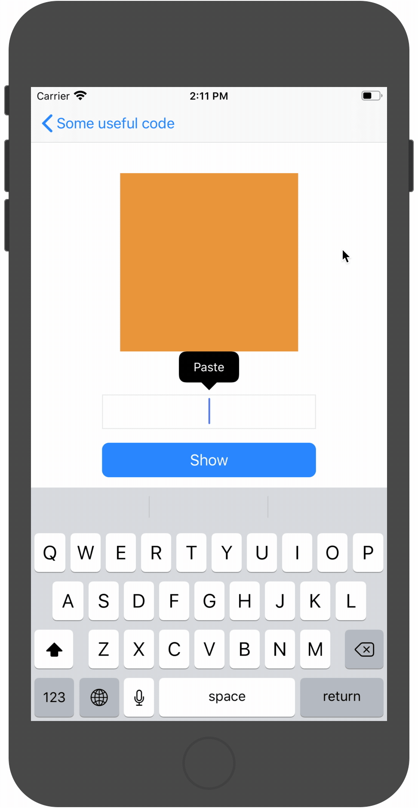
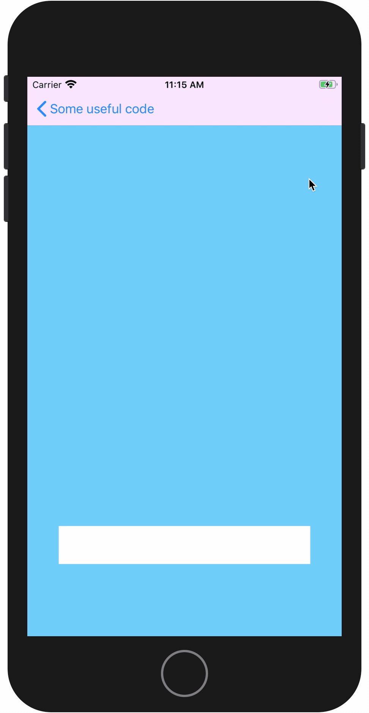

#  Một số đoạn code hữu ích
App này là app tổng hợp một số đoạn code hữu ích mình tìm được trong quá trình học Swift. Một số đoạn code liên quan đến logic, thuận
toán nên có thể sẽ không có file GIF demo.

## Danh sách
### 1. Ẩn keyboard khi chạm ra ngoài bàn phím

### 2. Chuyển chuỗi màu Hex sang màu RGB

### 3. Tách thành phần View ra khỏi ViewController với phương thức override loadView()

### 4. Điều chỉnh lại vị trí của textField khi hiện keyboard

